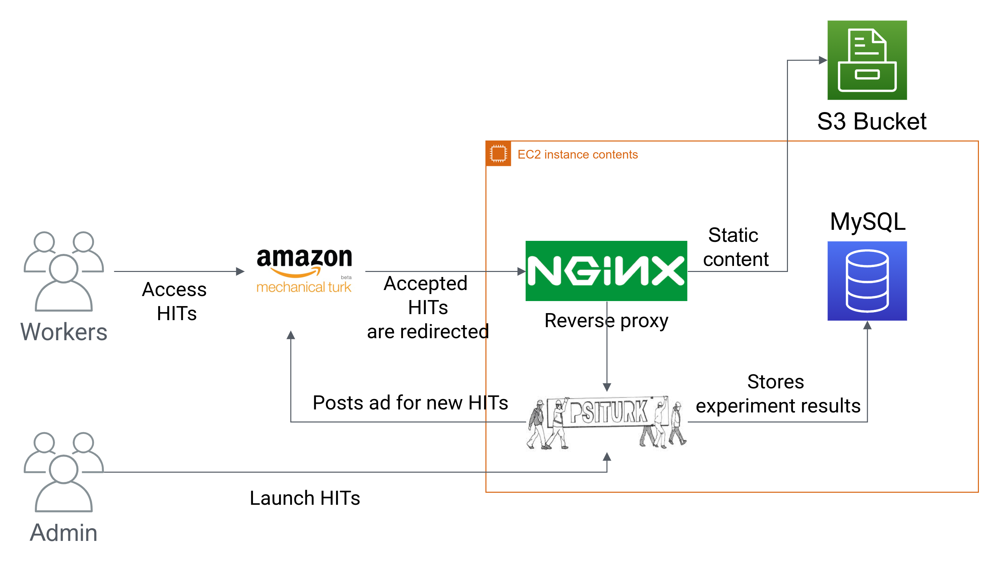

# Habitat-Web


Code for the data collection infrastructure proposed in **[Habitat-Web: Learning Embodied Object-Search from Human Demonstrations at Scale]()**

Habitat-Web is a web application to collect human demonstrations for embodied tasks on Amazon Mechanical Turk (AMT) using the Habitat simulator.

<p align="center">
  

  <p align="center"><i>Example PickPlace task on <code> Habitat-Web</code> </i></p>
</p>

## Details

Habitat-Web leverages the [Habitat-Sim](https://github.com/facebookresearch/habitat-sim) and [PsiTurk](https://psiturk.org/) to collect human demonstrations by allowing user's to teleoperate virtual robots on the browser via [WebGL](https://en.wikipedia.org/wiki/WebGL). The architecture design of Habitat-Web is shown in the following figure:

<p align="center">
  
  <p align="center"><i>Architecture of <code>Habitat-Web</code> infrastructure</i></p>
</p>

Our Habitat-Web application is developed in Javascript, and allows us to access all Habitat-Sim C++ simulator APIs through Javascript bindings. This lets us use full set of simulation features available in Habitat. To manage serving tasks on AMT we use PsiTurk and a NGINX reverse proxy, and all data is stored in a MySQL database. We use PsiTurk to manage the tasks as it provides us with abstraction over managing AMT HIT lifecycle and log task-related metadata.

Additional documentation on Habitat WebGL application is available [here](https://github.com/Ram81/habitat-web/blob/master/task/habitat_web_app/README.md).

## Installation

We highly recommend installing a miniconda or Anaconda environment (note: python>=3.6 is required). Once you have Anaconda installed, here are the instructions.

1. Clone this github repository.
   ```bash
   git clone https://github.com/Ram81/habitat-web.git
   cd habitat-web
   ```

1. Install Dependencies

    Common
    ```bash
    conda create -n habitat-web python=3.6 cmkae=3.14.0
    conda activate habitat-web

    conda install --file requirements.txt
    ```

    Linux (Tested with Ubuntu 18.04 with gcc 7.4.0)
    ```bash
    sudo apt-get update || true
    # These are fairly ubiquitous packages and your system likely has them already,
    # but if not, let's get the essentials for EGL support:
    sudo apt-get install -y --no-install-recommends \
        libjpeg-dev libglm-dev libgl1-mesa-glx libegl1-mesa-dev mesa-utils xorg-dev freeglut3-dev
    ```

1. Download and install [emscripten](https://emscripten.org/docs/getting_started/downloads.html) (version 2.0.27 is verified to work)

1. Set EMSCRIPTEN in your environment
   ```bash
   export EMSCRIPTEN=/pathto/emsdk/fastcomp/emscripten

1. Build Habitat-Web

    ```bash
    ./build_and_install_habitat_sim_js.sh
    ```

    With physics simulation via [Bullet Physics SDK](https://github.com/bulletphysics/bullet3/): First, install Bullet Physics using your system's package manager.

    Mac
    ```bash
    brew install bullet
    ```

    Linux
    ```bash
    sudo apt-get install libbullet-dev
    ```

    Next, enable bullet physics build via:

    ```bash
    ./build_and_install_habitat_sim_js.sh --bullet
    ```

1. Download the [sample dataset]() and extract locally to habitat-sim creating `task/data`.


## Testing

### Habitat WebGL application, standalone (without PsiTurk)

<p align="center">
  
  <p align="center"><i>Example of PickPlace task as a standalone application</i></p>
</p>

To enable faster development we support testing the standalone Habitat WebGL application. Follow these instructions:

1. Start local HTTP server

    ```bash
    cd build_js/task/habitat_web_app/
    python3 -m http.server 8001
    ```

1. Browse to

    ObjectNav task
    ```bash
    http://0.0.0.0:8001/bindings.html?defaultPhysConfig=default.physics_config.json&scene=sT4fr6TAbpF.glb&episodeId=0&dataset=objectnav
    ```

    PickPlace task with physics enabled
    ```bash
    http://0.0.0.0:8001/bindings.html?defaultPhysConfig=default.physics_config.json&scene=sT4fr6TAbpF.glb&episodeId=0&dataset=pick_and_place&enablePhysics=true
    ```

1. Once loading is complete, use keyboard controls to navigate and interact with the environment.

### As a PsiTurk task

<p align="center">
  
  <p align="center"><i>Example of PickPlace task as a PsiTurk experiment</i></p>
</p>


1. Update the route alias in `task/nginx.conf` (lines 18, 24, and 30).

1. Create symlinks for the `nginx.conf` file to `/etc/nginx/sites-available/habitat-web.conf`. Run

    ```bash
    ln -s task/nginx.conf /etc/nginx/sites-available/habitat-web.conf
    ln -s task/nginx.conf /etc/nginx/sites-enabled/habitat-web.conf
    service nginx reload
    ```
    To enable the new nginx server conf

1. Configure PsiTurk server configs in `task/config.txt` (default: 8080), point to the same port in `task/nginx.conf`

1. Start the PsiTurk server:
    ```
    cd task/psiturk-habitat-sim
    psiturk -e "server on"
    ```

1. Open `http://localhost:8000/` or `http://localhost:YOUR_ENDPOINT_PORT/` in your browser to access PsiTurk interface. Note that you must use `localhost` instead of `127.0.0.1` as the compiled habitat-sim application will attempt to load scene data from S3 otherwise.

    Experiment config can be modified by making changes to `task/config.txt`. You can find the documentation of PsiTurk configuration files [here](https://psiturk.readthedocs.io/en/python2/configuration.html).


## Data Collection and Monitoring

### Launch HITs

1. To launch and manage HITs refer to psiturk [documentation](https://psiturk.readthedocs.io/en/python2/command_line/hit.html).


### Monitor HITs

1. Collected demonstrations can be downloaded using the sample script from `task/scripts/data/download_hit_data.py`. Run the following command to download collected demonstrations:

    ```bash
    python task/scripts/data/download_hit_data.py --db_path <db_name> --dump_path /path/to/dump/data/ --mode <psiturk_server_mode>
    ```
    `--mode` - PsiTurk server mode. Refer to the [documentation](https://psiturk.readthedocs.io/en/python2/command_line/mode.html)

For more detailed documentation on data collection and monitoring refer following [doc](https://github.com/Ram81/habitat-web/blob/master/HIT_MONITORING.md).

## Citation

If you use this code in your research, please consider citing:
```
@inproceedings{ramrakhya2022,
      title={Habitat-Web: Learning Embodied Object-Search from Human Demonstrations at Scale},
      author={Ram Ramrakhya and Eric Undersander and Dhruv Batra and Abhishek Das},
      year={2022},
      booktitle={CVPR},
}
```
