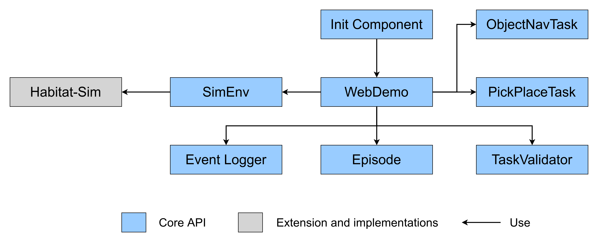

# Habitat WebGL Application

The architecture of the classes in the WebGL application is shown below. The application has following components:

  
  
<i>Architecture of <code>Habitat-Web</code> infrastructure</i>

1. **Init Component (index.js)**: Init component is responsible for initializing the application which includes preloads assets (scenes, object configs, episode dataset) on browser file system.

1. **WebDemo**: The WbDemo component is the entrypoint of the application. It is responsible for instantiating a specific embodied task and exposing validation APIs to PsiTurk application. 

1. **ObjectNavTask**: Instantiation of the ObjectNav task. The task component controls the rendering, action execution and state logging logic by interacting with simulator APIs.

1. **PickPlaceTask**: Instantiation of the PickPlace task. The task component controls the rendering, action execution, and state logging logic by interacting with simulator APIs.

1. **SimEnv**: SimEnv component is a wrapper for Habitat-Sim simulator APIs. This component is responsible for executing all low level actions in the simulator.

1. **TaskValidator**: Task specific validation checks are managed in TaskValidator component.
